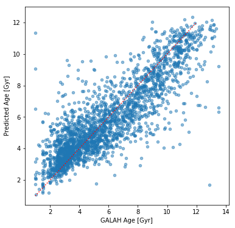

# Chemical Clocks

Galaxies are factories that convert gas into stars, and in the process they constantly evolve. Atoms are fused into heavies ones by stars and then are dispersed into space, where they become the building blocks for a next generation of stars. Therefore, young stars have heavy elements in greater abundance than older stars. Therefore, it is possible to use the chemical composition of stars to infer their age. The relations linking chemical abundances to stellar ages are commonly called "chemical clocks" (see [Spina et al. 2016](https://ui.adsabs.harvard.edu/abs/2016A%26A...593A.125S/abstract), [Spina et al. 2018](https://ui.adsabs.harvard.edu/abs/2018MNRAS.474.2580S/abstract)).

In [chemical_clocks.ipynb](chemical_clocks.ipynb) I am using a XGBoost regressor to predict the age of stars. The Machine Learning algorithm is trained over a sample of star whose ages and chemical abundances of different elements (iron, oxygen, barium, sodium, magnesium, yttrium, and titanium) are well known. 

The figure below shows the results of this modelling: the predicted age is plotted as a function of the actual age. As expected, there is an excellent relation between the two.

